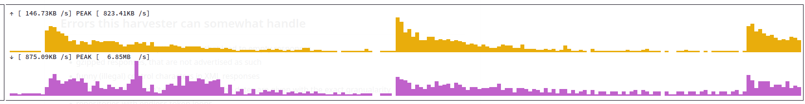

# metha

> The Open Archives Initiative Protocol for Metadata Harvesting (OAI-PMH) is a
> low-barrier mechanism for repository interoperability. Data Providers are
> repositories that expose structured metadata via OAI-PMH. Service Providers
> then make OAI-PMH service requests to harvest that metadata. -- https://www.openarchives.org/pmh/

----

Note to existing users - **two significant changes starting with 0.5.0**:

* we use a single command `metha` and subcommands for the previously separate binaryies, e.g. `metha-sync` becomes `metha sync` (we provide **shims** for the transition)
* we switch to a new internal storage layout: to migrate an existing cache to the new layout, simply type:

```
$ metha migrate --dry-run
```

This will list the cached endpoint data, that will be converted. If that looks good, run:


```
$ metha migrate --rm # to remove the previous files after migration is fully done
```

----

The metha command line tool can gather information on OAI-PMH endpoints and
harvest data incrementally. The goal of metha is to simplify data access.

[](https://zenodo.org/badge/latestdoi/56384577) [](https://www.repostatus.org/#active)

The metha tool has been developed for [project finc](https://finc.info) at
[Leipzig University Library](https://ub.uni-Leipzig.de) ([lab](https://lab.ub.uni-leipzig.de/metha/)).

## Why yet another OAI harvester?

* I wanted to crawl [Arxiv](http://export.arxiv.org/oai2) but found that existing tools would timeout.
* Some harvesters would start to download all records anew, if I interrupted a running harvest.
* There are many OAI
  [endpoints](https://raw.githubusercontent.com/miku/metha/master/contrib/sites.tsv) out
  there. It is a widely used
  [protocol](http://www.openarchives.org/OAI/openarchivesprotocol.html) and
  somewhat worth knowing.
* I wanted something simple for the command line; also fast and robust, while not stressing servers too much

## How it works

The functionality is spread accross a few different subcommands:

* metha sync for harvesting
* metha cat for viewing
* metha id for gathering data about endpoints
* metha ls for inspecting the local cache
* metha files for listing the associated files for a harvest
* metha sweep for harvesting every known endpoint, on a schedule
* metha endpoints for what the sweep learned about each one
* metha export for writing the whole cache out as one stream of records

To harvest and endpoint in the default *oai_dc* format (e.g. [arxiv.org](https://info.arxiv.org/help/oa/index.html)):

```sh
$ metha sync https://oaipmh.arxiv.org/oai
...
```

All downloaded files are written to a directory below a base directory. The base
directory is `~/.cache/metha` by default and can be adjusted with the `METHA_DIR`
environment variable.

When the `--dir` flag is set, only the directory corresponding to a harvest is printed.

```
$ metha sync --dir https://oaipmh.arxiv.org/oai
/Users/tir/Library/Caches/metha/62/4a/624afaf261ab83ec
```

```sh
$ METHA_DIR=/tmp/ ./metha sync --dir https://oaipmh.arxiv.org/oai
/tmp/62/4a/624afaf261ab83ec
```

The harvesting can be interrupted at any time and the HTTP client will
automatically retry failed requests a few times before giving up.

To stream the harvested XML data to stdout run:

```sh
$ metha cat https://oaipmh.arxiv.org/oai
```

You can emit records based on datestamp as well:

```sh
$ metha cat --from 2016-01-01 https://oaipmh.arxiv.org/oai
```

This will only stream records with a datestamp equal or after 2016-01-01.

To just stream all data really fast, use `find` and `zcat` over the harvesting
directory.

```sh
$ metha files https://oaipmh.arxiv.org/oai | xargs -n1 zstdcat
```

To display basic repository information:

```sh
$ metha id https://oaipmh.arxiv.org/oai
```

To list all harvested endpoints:

```sh
$ metha ls
```

Further examples can be found in the metha [man page](https://github.com/miku/metha/blob/master/docs/metha.md):

```
$ man metha
```

## Installation

Use a deb, rpm [release](https://github.com/miku/metha/releases), or the go tool:

```sh
$ go install -v github.com/miku/metha/cmd/metha@latest
```

Since 0.5 metha is a single binary with one subcommand per verb: `metha sync`,
`metha cat`, `metha ls` and so on. See `metha help`.

The nine commands metha used to install — `metha-sync`, `metha-cat`, … — are
still there as symlinks to it. metha reads the name it was invoked under and
runs the matching verb, so existing scripts keep working, flags included. The
packages install those names for you; after a `go install` you can add them with

```sh
$ metha shim install
```

They print a one-line deprecation notice when run from a terminal (silence it
with `METHA_NO_DEPRECATION=1`) and will be removed in metha 2.0.

`go install github.com/miku/metha/cmd/metha-sync@latest` and friends still
resolve throughout the 0.5.x line, but each one builds the whole program: nine
of them come to about 186MB, where the single binary is about 25MB.

## Harvesting Roulette

In 0.1.27 a `metha fortune` command was added, which fetches a random article
description and displays it.

```shell
$ metha fortune
Active Networking is concerned with the rapid definition and deployment of
innovative, but reliable and robust, networking services. Towards this end we
have developed a composite protocol and networking services architecture that
encourages re-use of protocol functions, is well defined, and facilitates
automatic checking of interfaces and protocol component properties. The
architecture has been used to implement common Internet protocols and services.
We will report on this work at the workshop.

    -- http://drops.dagstuhl.de/opus/phpoai/oai2.php

$ metha fortune
In this paper we show that the Lempert property (i.e., the equality between the
Lempert function and the Carathéodory distance) holds in the tetrablock, a
bounded hyperconvex domain which is not biholomorphic to a convex domain. The
question whether such an equality holds was posed by Abouhajar et al. in J.
Geom. Anal. 17(4), 717–750 (2007).

    -- http://ruj.uj.edu.pl/oai/request

$ metha fortune
I argue that Gödel's incompleteness theorem is much easier to understand when
thought of in terms of computers, and describe the writing of a computer
program which generates the undecidable Gödel sentence.

    -- http://quantropy.org/cgi/oai2

$ metha fortune
Nigeria, a country in West Africa, sits on the Atlantic coast with a land area
of approximately 90 million hectares and a population of more than 140 million
people. The southern part of the country falls within the tropical rainforest
which has now been largely depleted and is in dire need of reforestation. About
10 percent of the land area was constituted into forest reserves for purposes
of conservation but this has suffered perturbations over the years to the
extent that what remains of the constituted forest reserves currently is less
than 4 percent of the country land area. As at today about 382,000 ha have been
reforested with indigenous and exotic species representing about 4 percent of
the remaining forest estate. Regrettably, funding of the Forestry sector in
Nigeria has been critically low, rendering reforestation programme near
impossible, especially in the last two decades. To revive the forestry sector
government at all levels must re-strategize and involve the local communities
as co-managers of the forest estates in order to create mutual dependence and
interaction in resource conservation.

    -- http://journal.reforestationchallenges.org/index.php/REFOR/oai
```

## Scrape all metadata in a best-effort way

`metha sweep` harvests every endpoint metha knows about — 244,040 of them, seeded
from the embedded list — records what became of each one, and exits. Example scrapes,
converted to JSON: 326M records, 60+ GB:
[2023-11-01-metha-oai.ndjson.zst](https://archive.org/download/oai_harvest_2023-11-01/2023-11-01-metha-oai.ndjson.zst),
and
[2026-02-23-oaiscrape-unique.jsonl.zst](https://archive.org/download/oaiscrape-2026-02-27/2026-02-23-oaiscrape-unique.jsonl.zst) (214M records, 41GB compressed).

```shell
$ metha sweep --dry-run     # what is due, without a single request
$ metha sweep --limit 100   # try it on a hundred endpoints
$ metha sweep               # everything due, with the defaults
```

It keeps a roster beside the cache, `sweep.json.zst`, holding one profile per
endpoint: when it was last attempted, what happened, and when it is next due.
That memory is the whole point. An endpoint that answers is polled daily; one
that has never resolved backs off to a few requests a year, and is never dropped,
because repositories move and domains come back. Requests are partitioned by
host, so a repository with several hundred endpoints is never asked more than one
question at a time.

A sweep is bounded twice — `--deadline` per endpoint (1h), `--budget` for the
whole run (24h) — and everything harvested before either fires is kept. Two
sweeps cannot overlap: the second finds the lock held, says so, and exits 0.

`metha endpoints` is the view onto what it learned, and it prints URLs one per
line so its output is an input:

```shell
$ metha endpoints --state quarantined       # what has stopped answering
$ metha endpoints --class gone              # what never answered at all
$ metha endpoints --slower-than 5m --json   # what a sweep spends its time on
$ metha endpoints --state active            # the corrected endpoint list
$ metha endpoints --import my-endpoints.txt # add your own
```

To run it nightly, use the
[metha.service](https://raw.githubusercontent.com/miku/metha/master/extra/linux/metha.service)
and
[metha.timer](https://raw.githubusercontent.com/miku/metha/master/extra/linux/metha.timer)
units; see [extra/linux](extra/linux) for how to install them, and for what
they replaced.

## Exporting the whole cache

metha stores harvested data in one file per interval. `metha export` writes all
of it out as one stream, one JSON document per line:

```shell
$ metha export -o corpus.ndjson.zst    # compressed by extension
$ metha export | jq .header.identifier # or straight down a pipe
$ metha export --from 2024-01-01       # only what is recent
```

Every line carries an `endpoint` field naming the repository the record came
from — the one thing an OAI-PMH record does not say about itself, and the one
thing a corpus of a few hundred million of them needs:

```shell
$ metha export | jq -r '[.endpoint, .header.identifier] | @tsv'
```

It reads and never writes the cache, and takes no locks, so it is safe to run
while a sweep is harvesting. To export part of the corpus, name endpoints as
arguments or pass a file of them — which is what `metha endpoints` prints:

```shell
$ metha endpoints --state active > live.txt
$ metha export --endpoints live.txt -o live.ndjson.zst
```

`--xml` writes one XML document instead, and the record filters `metha cat`
has — `--from`, `--until`, `--setspec`, `--deleted` — all work the same way
here.



## Errors this harvester can somewhat handle

* responses with resumption tokens that lead to empty responses
* gzipped responses, that are not advertised as such
* funny (illegal) control characters in XML responses
* repositories, that won't respond unless the dates are given with the exact granualarity
* repositories with endless token loops
* repositories that do not support selective harvesting, use `-no-intervals` flag
* limited repositories, metha will try a few times with an exponential backoff
* repositories, which throw occasional HTTP errors, although most of the responses look good, use `-ignore-http-errors` flag

## Authors

* Martin Czygan <martin.czygan@uni-leipzig.de>
* Natanael Arndt, [https://github.com/white-gecko](https://github.com/white-gecko)
* Gunnar Þór Magnússon, [https://github.com/gunnihinn](https://github.com/gunnihinn)
* Thomas Gersch, [https://github.com/titabo2k](https://github.com/titabo2k)
* [Andreas Czerniak](https://github.com/ACz-UniBi)
* [David Glück](https://github.com/dvglc)
* [Justin Kelly](https://github.com/justinkelly)

## Misc

Show formats of random repository:

```shell
$ shuf -n 1 <(curl -Lsf https://git.io/vKXFv) | xargs -I {} metha id {} | jq .formats
```

A snippet from a 2010 publication:

> The Open Archives Protocol for Metadata Harvesting
(OAI-PMH) (Lagoze and van de Sompel, 2002) is currently implemented by more
than 1,700 digital library reposi- tories world-wide and enables the exchange
of metadata via HTTP. -- [Interweaving OAI-PMH Data Sources with the Linked Data Cloud](http://eprints.cs.univie.ac.at/73/1/ijmso2010_haslhofer_schandl.pdf)

## Metha elsewhere

* [The finc project](https://finc.info/de/datenquellen)
* [UB LEIPZIG LAB](https://lab.ub.uni-leipzig.de/metha/)
* [Getting a dump of arXiv metadata](https://academia.stackexchange.com/questions/38969/getting-a-dump-of-arxiv-metadata) at [academia.stackexchange.com](https://academia.stackexchange.com/)
* [Keyword Extraction from arXiv - Part 1](http://web.archive.org/web/20191111162743/http://akumano.site/posts/arxiv-keyword-extraction-part1/)
* [Openrefine use case: Automated workflow for harvesting, transforming and indexing of bibliographic metadata](https://groups.google.com/forum/#!topic/openrefine/RqQwlF-ll1c)
* [Sammeln und Finden. Über das Sichtbarmachen von Open Science in Hamburg](https://opus4.kobv.de/opus4-bib-info/files/3645/HOS+Bibliothekartag.pdf) (PDF)
* [acohan/arxiv-tools](https://github.com/acohan/arxiv-tools)
* [Arxiv on Archive](https://archive.org/details/arxiv-bulk-metadata)
* [Metadata analysis of 80,000 arxiv:physics/astro-ph articles](https://quantumdynamics.wordpress.com/2016/06/12/metadata-analysis-of-80000-arxivastro-ph-articles-reveals-biased-moderation/)
* [Arxiv Harvesting](https://trislee.com/arxiv/)
* [Orcid](https://trello.com/c/3OrWa2ZY/5771-load-issn-metadata-into-registry-db-8)
* [Tutorial on Topological Data Analysis](https://github.com/shizuo-kaji/TutorialTopologicalDataAnalysis/blob/master/NLP_example.md)
* [Connectome](https://cms.www.switch.ch/fr/connectome/) (linked open research data, [#28](https://github.com/miku/metha/issues/28#issuecomment-1144526453)), [From MARCXML to Records in Contexts](https://zenodo.org/record/7400442/files/SWITCH%20Patrinum%20RiC_20221205_Wildi.pdf)
* [Comparison w/ other OAI tools](https://github.com/Deutsche-Digitale-Bibliothek/ddblabs-ometha#geschwindigkeit) (de)
* [biblio.ai](https://github.com/biblio-ai/extract)

## Asciicast

[](https://asciinema.org/a/271660)
